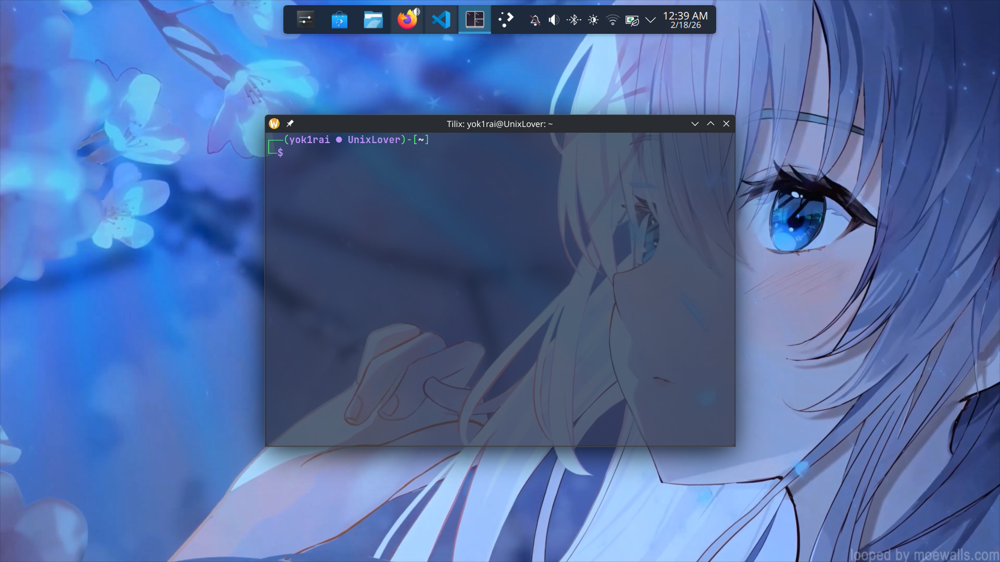

# Purple Wizard Theme




This script automatically sets up **Tilix** with the **[Purple Wizard Theme](https://github.com/yok1rai/purple-wizard "https://github.com/yok1rai/purple-wizard")**

## Features

- Installs tilix and zsh
- Installs JetBrainsMono Nerd font if not present
- Applies custom Tilix settings
- Installs helper utilities

## How to install

1. Install dependencies (git)

for apt (debian/ubuntu):

```bash
sudo apt update && sudo apt install git
```

for dnf (fedora, rhel):

```bash
sudo dnf install git
```

for pacman (arch):

```bash
sudo pacman -S git
```

2. clone the repository

```bash
git clone https://github.com/yok1rai/purple-wizard.git
```

3. go to the target directory

```bash
cd purple_wizard
```

4. give execute permission to `./install`

```bash
chmod +x ./install
```

5. run the installation app

```bash
./install
```

## utilities

available utility tools: **htilix**

1. htilix

a simple tool that prints the keybinds of the tilix

**flags**

- `-c`    : Show the output directly in the terminal using `cat`
- `l`     : Scroll interactively in the output using less -R. **Default**
- `-e`    : Scroll interactively with colors preserved and do not clear the screen on exit using `less -RX`
- `-h`    : help menu

## Information

if you already have a ~/.zshrc file, it will be moved to ~/.zshrc.bak so don't worry


